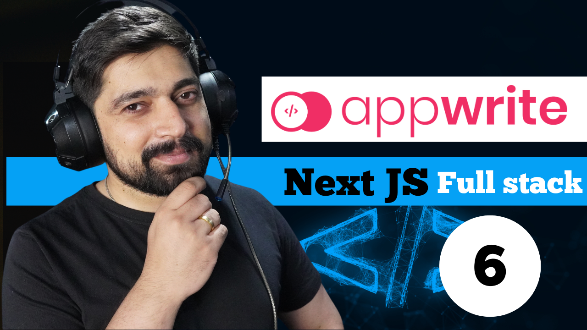

# A detailed course to undestand nextjs

This long video was designed to give you an indepth understanding about latest nextjs and how it works. If you have improved the project add your repo link in the assignment section. Please do not change main code files as students need to learn from the same code.

## Tech Stack
- Nextjs
- typescript
- mongodb
- mailtrap



---
Available on my youtube channel
[Youtube channel link](https://www.youtube.com/@HiteshChoudharydotcom)

## Getting Started

First, run the development server:

```bash
npm run dev
# or
yarn dev
# or
pnpm dev
```
## Assignment
1. Improve the UI of the application
2. Add a new feature to the application
---
## your completed assignments

- Add your repo link here
- 


---
